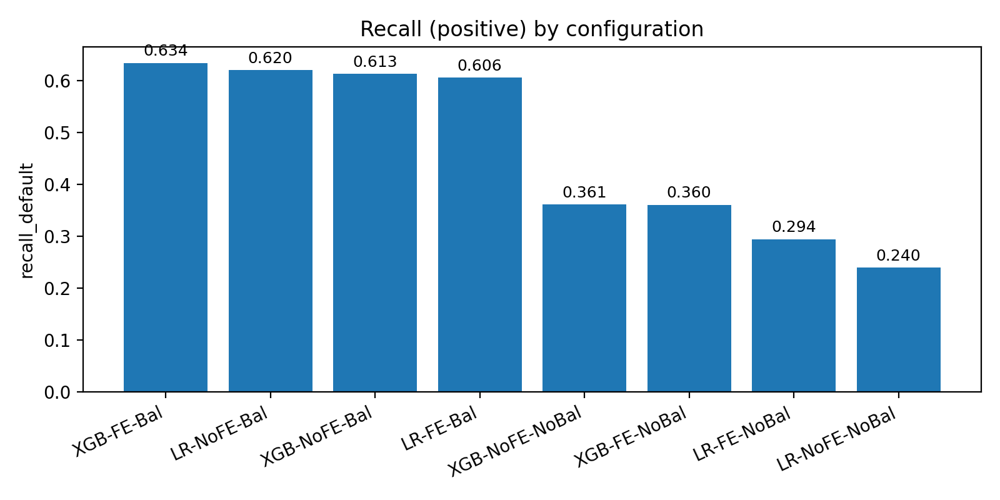
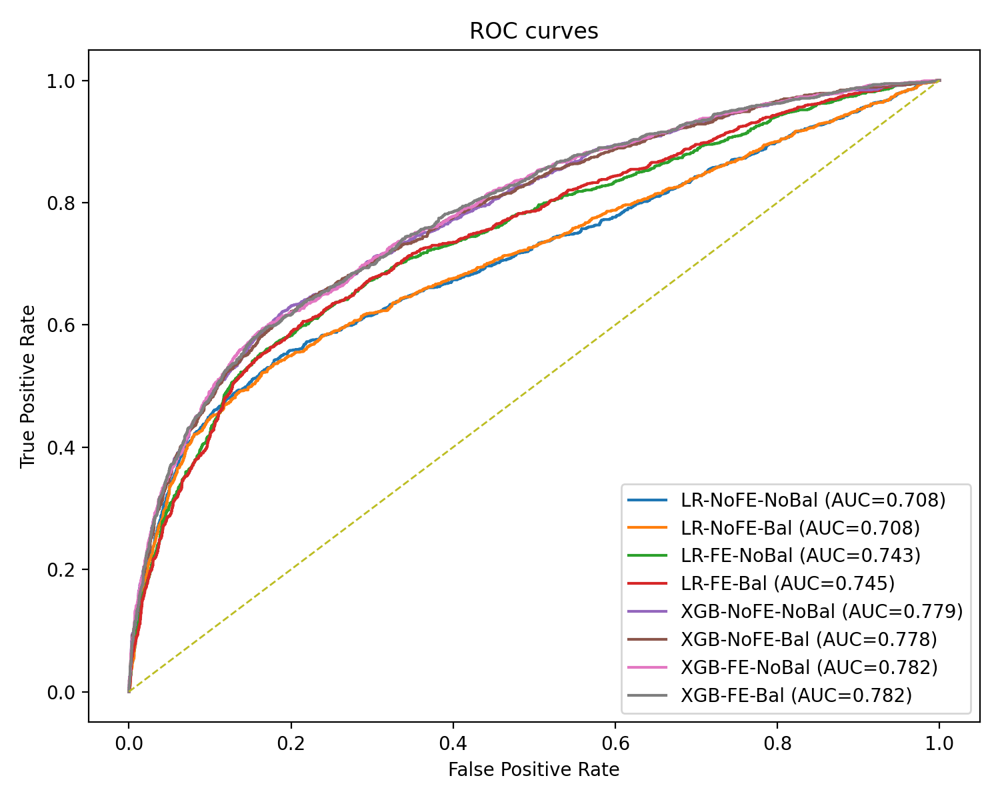
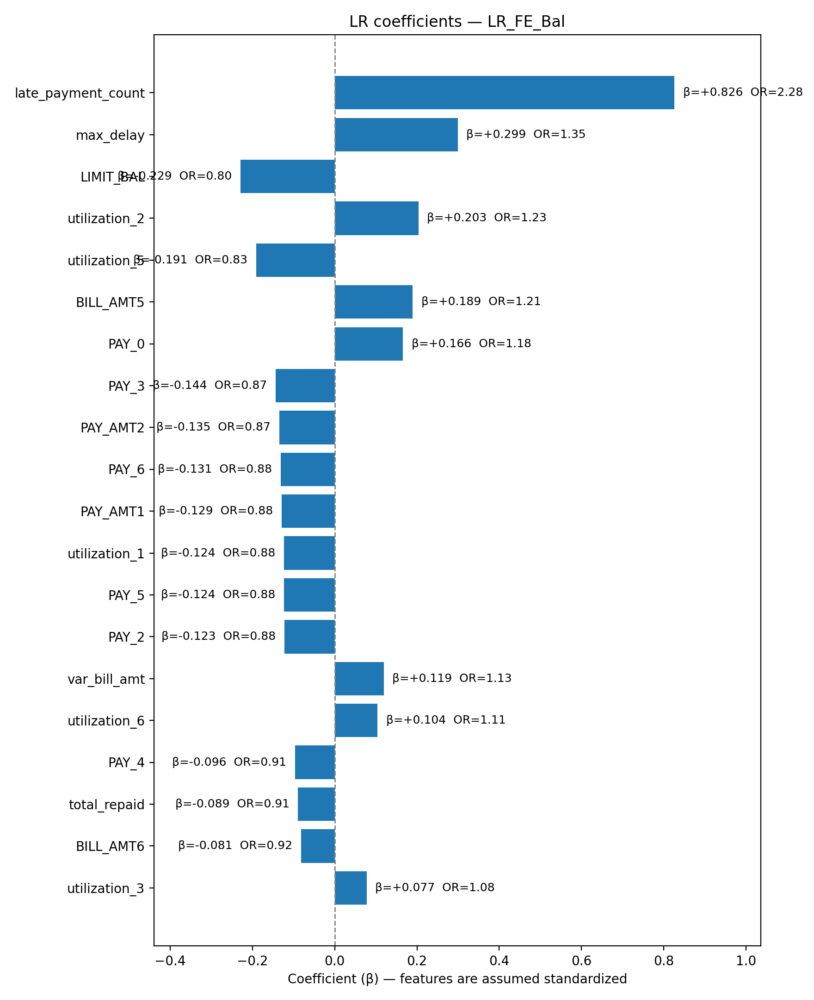
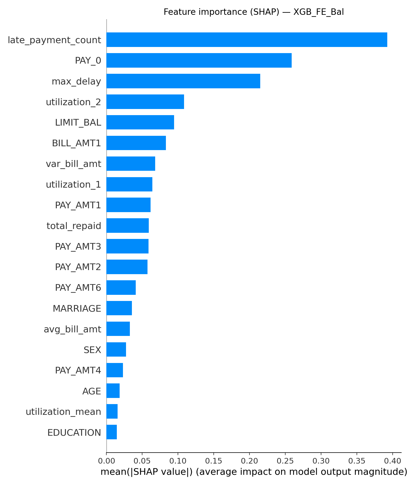

## Taiwan Credit Default Prediction (LR vs XGBoost)

Comparative study of Logistic Regression and XGBoost for predicting
credit default risk on the UCI Default of Credit Card Clients dataset
(30,000 accounts; ~22% default rate).

The project investigates the impact of:

-   Feature engineering
-   Class imbalance handling
-   Model choice (interpretable vs ensemble methods)

All experiments are implemented in Python with a reproducible automated
pipeline and CLI interface.

This repository contains the full implementation developed for the
seminar paper:

[Reibold F., Eren B., Öztürk M. (2025) Taiwan Credit Default Prediction: Feature Engineering, Class Imbalance, and Model Comparison. Seminar paper, Technical University of Munich.](seminar-paper-credit-default-prediction-taiwan.pdf)

## Problem Overview

Credit scoring is a supervised classification task:

Input:
Demographic and financial information of credit card holders
(limit, repayment history, bill amounts, delinquency signals)

Output:
Binary prediction: default (1) or non-default (0)

The objective is to improve detection of high-risk borrowers while
balancing interpretability and predictive performance.

Dataset: [Yeh, I. (2009). Default of Credit Card Clients [Dataset]. UCI Machine Learning Repository.](https://doi.org/10.24432/C55S3H) 

-   30,000 observations
-   23 input features
-   ~22% default rate (imbalanced dataset)

## Experimental Design

### Configurations

We evaluate 8 configurations:

{LR, XGB} × {Feature Engineering, No Feature Engineering} ×
{Balance-aware, Not balance-aware}

### Feature Engineering (FE)

FE was performed and is described in detail in our paper. These features capture repayment behavior, liquidity pressure, and
delinquency persistence.

### Class Imbalance Handling

In the dataset the default rate ≈ 22%. Balancing improves recall (default detection) at the cost of overall
accuracy, a realistic trade-off in credit risk modeling.

### Evaluation Metrics

Models are tuned via cross-validation and evaluated on a hold-out test
set using:

-   ROC-AUC
-   Precision-Recall curves
-   Recall (minority-class detection)
-   Balanced Accuracy
-   Confusion matrices
-   Feature importance analysis

## Results

Performance Summary

-   XGBoost achieves the strongest overall ROC and PR curves
-   Best recall ≈ 63%
-   Balanced accuracy highest among tested models
-   Logistic Regression performs surprisingly close to XGB

### Key Insight

Despite slightly lower performance, Logistic Regression with Feature
Engineering and class weighting offers a strong, interpretable baseline,
making it attractive in regulated financial environments.

### Most Predictive Signals

The best indicator that someone will default is any sort of precedence in their history to struggle to pay back credit.

-   late_payment_count (strongest signal)
-   Recent delinquency codes (PAY_0…PAY_6)
-   Credit utilization
-   Repayment consistency

Higher credit limits and stronger repayment ratios correlate with lower
default probability.

### Recall Comparison

  

The best-performing configuration achieves a recall of approximately **63%**, meaning that nearly two-thirds of actual default cases are correctly identified. In credit risk modeling, recall is especially important because missing a defaulter (false negative) is typically more costly than incorrectly flagging a non-defaulter. Among all tested configurations, the balance-aware XGBoost model achieved the highest recall, making it the strongest model for minority-class detection.

### ROC Curve Comparison

  

All models outperform random guessing (diagonal baseline), with XGBoost variants achieving the highest overall ROC-AUC, indicating superior discrimination between defaulters and non-defaulters.

### Feature Importance – Logistic Regression (FE + Balanced)

  

Standardized coefficients highlight the importance of delinquency-related variables such as `late_payment_count` and recent repayment status. Logistic Regression offers clear interpretability via odds-ratio interpretation.

### Feature Importance – XGBoost (FE + Balanced)

  

SHAP-based feature importance confirms that delinquency signals dominate predictive performance. While XGBoost achieves slightly higher predictive accuracy, interpretability requires post-hoc explanation techniques.

## Repository Structure

    Credit_Default_Prediction/
    │
    ├── CreditScoringTaiwanExperiments.py   # Main experimental pipeline
    ├── DataAnalysis.py                     # Exploratory data analysis
    ├── EvaluationPlots.py                  # ROC, PR, feature importance plots
    ├── seminar-paper-credit-default-prediction-taiwan.pdf
    ├── requirements.txt
    └── README.md

Generated experiment outputs are written to:

    Containment/
      ├── results/
      ├── preds/
      ├── models/
      ├── xtest/
      └── data/

(Outputs are not tracked in Git to keep the repository lightweight.)

## Requirements

-   Python 3.10+
-   Packages listed in requirements.txt

Install:

    pip install -r requirements.txt

## Run

The script can be run via the following parameters over the Command Line Interface (CLI)

Full 8-experiment batch (“overnight”). <- It doesn't really take that long :D

    python CreditScoringTaiwanExperiments.py --overnight --score roc_auc

Logistic Regression only

    python CreditScoringTaiwanExperiments.py --no-xgb --score roc_auc

Without feature engineering

    python CreditScoringTaiwanExperiments.py --no-fe

## Methodological Highlights

-   Automated CLI-based experimental runner
-   Clean separation between:
    -   data loading
    -   preprocessing
    -   feature engineering
    -   tuning
    -   evaluation
-   Reproducible result tracking (CSV + JSON export)
-   Comparable experiment grid for model fairness

## Authors

Felix Reibold (M.Sc.); Beyza Eren (M.Sc.); Mehmet Emin Öztürk (M.Sc.)

## Citation

If you use this code or model, please cite:

Reibold F., Eren B., Öztürk M. (2025) **Taiwan Credit Default Prediction: Feature Engineering, Class Imbalance, and Model Comparison.** Seminar paper, Technical University of Munich.